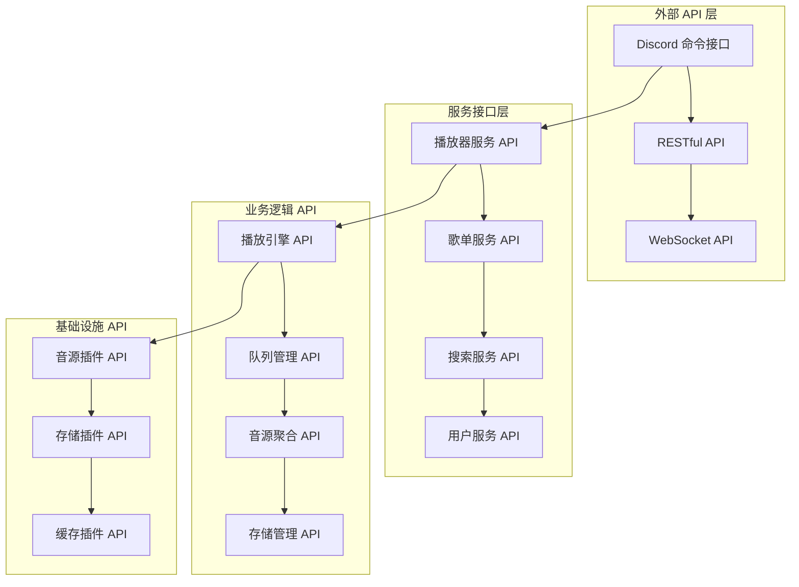

# BotPlayer 插件 API 设计文档

## 概述

BotPlayer 是一个完整的音乐播放器插件，提供多音源支持、歌单管理、用户存档等功能。本文档详细描述了插件的 API 设计，包括内部接口、外部 API 和数据结构定义。

## 核心 API 架构

### API 分层设计



## Discord 命令 API

### 音乐播放命令

#### !music play
**功能**: 搜索并播放音乐
**语法**: `!music play <搜索关键词>`
**参数**:
- `query`: 搜索关键词（歌名、歌手、专辑等）
**返回**: 播放状态消息
**示例**:
```
!music play 春日影 MyGO
!music play YOASOBI 夜に駆ける
```

#### !music queue
**功能**: 管理播放队列
**语法**: `!music queue [操作] [参数]`
**操作类型**:
- `show`: 显示当前队列
- `add <歌曲>`: 添加歌曲到队列
- `remove <索引>`: 删除指定位置歌曲
- `clear`: 清空队列
- `shuffle`: 随机打乱队列

#### !music control
**功能**: 播放控制
**子命令**:
- `!music pause`: 暂停播放
- `!music resume`: 恢复播放
- `!music stop`: 停止播放
- `!music skip`: 跳过当前歌曲
- `!music previous`: 播放上一首
- `!music volume <0-100>`: 调节音量

#### !music mode
**功能**: 设置播放模式
**语法**: `!music mode <模式>`
**模式类型**:
- `sequence`: 顺序播放
- `shuffle`: 随机播放
- `repeat`: 列表循环
- `repeat-one`: 单曲循环

### 歌单管理命令

#### !playlist create
**功能**: 创建新歌单
**语法**: `!playlist create <歌单名> [描述]`
**参数**:
- `name`: 歌单名称
- `description`: 歌单描述（可选）
**返回**: 创建成功消息和歌单ID

#### !playlist import
**功能**: 通过 URL 导入 JSON 格式歌单
**语法**: `!playlist import <JSON_URL> [歌单名]`
**安全限制**:
- 仅支持 HTTPS URL
- 域名白名单验证
- 文件大小限制 (10MB)
- 仅支持 .json 格式
**支持格式**:
- MusicFreeBackup.json
- 通用 JSON 格式歌单
- M3U8 播放列表 JSON
**示例**:
```
!playlist import https://github.com/user/repo/raw/main/playlist.json 我的收藏
!playlist import https://gist.githubusercontent.com/user/id/raw/playlist.json 分享歌单
```

#### !playlist manage
**功能**: 歌单管理操作
**子命令**:
- `!playlist list`: 查看所有歌单
- `!playlist show <歌单ID>`: 显示歌单详情
- `!playlist play <歌单ID>`: 播放歌单
- `!playlist add <歌单ID> <歌曲>`: 添加歌曲到歌单
- `!playlist remove <歌单ID> <索引>`: 从歌单删除歌曲
- `!playlist share <歌单ID>`: 分享歌单

### 搜索发现命令

#### !search
**功能**: 音乐搜索
**语法**: `!search <关键词> [选项]`
**选项**:
- `--platform <平台>`: 指定搜索平台
- `--limit <数量>`: 限制结果数量
- `--quality <音质>`: 指定音质要求
**示例**:
```
!search MyGO --platform bilibili
!search 春日影 --limit 10 --quality high
```

#### !discover
**功能**: 音乐发现
**子命令**:
- `!discover trending`: 热门音乐
- `!discover recommend`: 个性化推荐
- `!discover genre <类型>`: 按风格推荐
- `!discover artist <歌手>`: 相似歌手推荐

### 用户管理命令

#### !profile
**功能**: 用户档案管理
**子命令**:
- `!profile show`: 显示个人资料
- `!profile history`: 播放历史
- `!profile favorites`: 收藏列表
- `!profile settings`: 个人设置

#### !sync
**功能**: 数据同步（仅查看状态）
**子命令**:
- `!sync status`: 查看同步状态
- `!sync backup`: 查看备份状态
**注意**: WebDAV 同步由管理员在后台配置，用户无法直接操作

## 内部服务 API

### 播放器服务 (PlayerService)

```python
class PlayerService:
    async def play_song(self, song: Song, guild_id: str) -> PlayResult:
        """播放指定歌曲"""
        
    async def pause_playback(self, guild_id: str) -> bool:
        """暂停播放"""
        
    async def resume_playback(self, guild_id: str) -> bool:
        """恢复播放"""
        
    async def stop_playback(self, guild_id: str) -> bool:
        """停止播放"""
        
    async def skip_song(self, guild_id: str) -> Song:
        """跳过当前歌曲"""
        
    async def set_volume(self, volume: float, guild_id: str) -> bool:
        """设置音量"""
        
    async def get_player_status(self, guild_id: str) -> PlayerStatus:
        """获取播放器状态"""
```

### 队列管理服务 (QueueService)

```python
class QueueService:
    async def add_song(self, song: Song, guild_id: str) -> bool:
        """添加歌曲到队列"""
        
    async def remove_song(self, index: int, guild_id: str) -> bool:
        """从队列删除歌曲"""
        
    async def get_queue(self, guild_id: str) -> List[Song]:
        """获取当前队列"""
        
    async def clear_queue(self, guild_id: str) -> bool:
        """清空队列"""
        
    async def shuffle_queue(self, guild_id: str) -> bool:
        """随机打乱队列"""
        
    async def set_play_mode(self, mode: PlayMode, guild_id: str) -> bool:
        """设置播放模式"""
        
    async def get_next_song(self, guild_id: str) -> Optional[Song]:
        """获取下一首歌曲"""
```

### 歌单服务 (PlaylistService)

```python
class PlaylistService:
    async def create_playlist(self, name: str, user_id: str, description: str = "") -> Playlist:
        """创建新歌单"""
        
    async def import_playlist(self, file_data: bytes, format: PlaylistFormat, user_id: str) -> Playlist:
        """导入歌单文件"""
        
    async def export_playlist(self, playlist_id: str, format: PlaylistFormat) -> bytes:
        """导出歌单文件"""
        
    async def add_song_to_playlist(self, playlist_id: str, song: Song) -> bool:
        """添加歌曲到歌单"""
        
    async def remove_song_from_playlist(self, playlist_id: str, song_index: int) -> bool:
        """从歌单删除歌曲"""
        
    async def get_user_playlists(self, user_id: str) -> List[Playlist]:
        """获取用户所有歌单"""
        
    async def share_playlist(self, playlist_id: str) -> str:
        """分享歌单，返回分享链接"""
```

### 搜索服务 (SearchService)

```python
class SearchService:
    async def search_songs(self, query: str, filters: SearchFilters = None) -> SearchResult:
        """搜索歌曲"""
        
    async def search_by_artist(self, artist: str) -> List[Song]:
        """按歌手搜索"""
        
    async def search_by_album(self, album: str) -> List[Song]:
        """按专辑搜索"""
        
    async def get_trending_songs(self, limit: int = 50) -> List[Song]:
        """获取热门歌曲"""
        
    async def get_recommendations(self, user_id: str, limit: int = 20) -> List[Song]:
        """获取个性化推荐"""
        
    async def get_similar_songs(self, song: Song, limit: int = 10) -> List[Song]:
        """获取相似歌曲"""
```

### 用户服务 (UserService)

```python
class UserService:
    async def get_user_profile(self, user_id: str) -> UserProfile:
        """获取用户档案"""
        
    async def update_user_preferences(self, user_id: str, preferences: UserPreferences) -> bool:
        """更新用户偏好"""
        
    async def add_to_play_history(self, user_id: str, song: Song, duration_played: int) -> bool:
        """添加播放历史"""
        
    async def add_to_favorites(self, user_id: str, song: Song) -> bool:
        """添加到收藏"""
        
    async def remove_from_favorites(self, user_id: str, song: Song) -> bool:
        """从收藏删除"""
        
    async def get_play_history(self, user_id: str, limit: int = 100) -> List[PlayRecord]:
        """获取播放历史"""
        
    async def backup_user_data(self, user_id: str) -> dict:
        """备份用户数据"""
        
    async def restore_user_data(self, user_id: str, backup_data: dict) -> bool:
        """恢复用户数据"""
```

## 音源插件 API

### 音源插件接口

```python
class MusicSourcePlugin:
    """音源插件基础接口"""
    
    @property
    def platform_name(self) -> str:
        """平台名称"""
        
    @property
    def is_available(self) -> bool:
        """检查音源是否可用"""
        
    async def search(self, query: str, limit: int = 20) -> List[Song]:
        """搜索音乐"""
        
    async def get_play_url(self, song_id: str, quality: str = "high") -> Optional[str]:
        """获取播放链接"""
        
    async def get_song_info(self, song_id: str) -> Optional[Song]:
        """获取歌曲详细信息"""
        
    async def get_lyrics(self, song_id: str) -> Optional[str]:
        """获取歌词"""
        
    async def verify_song_availability(self, song_id: str) -> bool:
        """验证歌曲可用性"""
```

### Bilibili 音源插件

```python
class BilibiliSourcePlugin(MusicSourcePlugin):
    @property
    def platform_name(self) -> str:
        return "bilibili"
    
    async def search(self, query: str, limit: int = 20) -> List[Song]:
        """搜索B站音频/视频"""
        
    async def get_play_url(self, bvid: str, quality: str = "high") -> Optional[str]:
        """获取B站视频音频流链接"""
        
    async def get_video_info(self, bvid: str) -> Optional[Song]:
        """获取B站视频信息"""
        
    async def extract_audio_stream(self, bvid: str) -> Optional[str]:
        """提取音频流"""
```

### 网易云音乐插件

```python
class NeteaseSourcePlugin(MusicSourcePlugin):
    @property
    def platform_name(self) -> str:
        return "netease"
    
    async def search(self, query: str, limit: int = 20) -> List[Song]:
        """搜索网易云音乐"""
        
    async def get_play_url(self, song_id: str, quality: str = "high") -> Optional[str]:
        """获取网易云音乐播放链接"""
        
    async def get_song_detail(self, song_id: str) -> Optional[Song]:
        """获取歌曲详情"""
        
    async def get_album_songs(self, album_id: str) -> List[Song]:
        """获取专辑歌曲列表"""
```

## 数据结构定义

### 核心数据模型

```python
@dataclass
class Song:
    """歌曲数据模型"""
    id: str                    # 唯一标识符
    title: str                 # 歌曲标题
    artist: str                # 艺术家
    album: str                 # 专辑名称
    duration: int              # 时长（秒）
    artwork_url: str           # 封面图片URL
    sources: List[SongSource]  # 音源列表
    lyrics: Optional[str]      # 歌词
    tags: List[str]           # 标签
    created_at: datetime      # 创建时间
    updated_at: datetime      # 更新时间

@dataclass
class SongSource:
    """歌曲音源数据模型"""
    platform: str             # 平台名称
    source_id: str            # 平台内ID
    play_url: str             # 播放链接
    quality: str              # 音质标识
    bitrate: int              # 比特率
    format: str               # 音频格式
    available: bool           # 是否可用
    verified_at: datetime     # 验证时间

@dataclass
class Playlist:
    """歌单数据模型"""
    id: str                   # 歌单ID
    name: str                 # 歌单名称
    owner_id: str             # 所有者ID
    description: str          # 描述
    songs: List[Song]         # 歌曲列表
    is_public: bool           # 是否公开
    tags: List[str]          # 标签
    created_at: datetime     # 创建时间
    updated_at: datetime     # 更新时间

@dataclass
class UserProfile:
    """用户档案数据模型"""
    user_id: str              # 用户ID
    display_name: str         # 显示名称
    preferences: UserPreferences  # 用户偏好
    playlists: List[str]      # 拥有的歌单ID列表
    favorites: List[str]      # 收藏歌曲ID列表
    play_history: List[PlayRecord]  # 播放历史
    created_at: datetime      # 创建时间
    last_active: datetime     # 最后活跃时间

@dataclass
class UserPreferences:
    """用户偏好设置"""
    default_quality: str      # 默认音质
    default_volume: float     # 默认音量
    auto_play: bool           # 自动播放
    shuffle_mode: bool        # 默认随机模式
    notifications: bool       # 通知开关
    privacy_mode: bool        # 隐私模式

@dataclass
class PlayRecord:
    """播放记录"""
    song: Song                # 歌曲信息
    played_at: datetime       # 播放时间
    duration_played: int      # 播放时长
    completed: bool           # 是否播放完成

@dataclass
class PlayerStatus:
    """播放器状态"""
    current_song: Optional[Song]  # 当前歌曲
    position: int                 # 播放位置（秒）
    duration: int                 # 歌曲总时长
    state: PlayState             # 播放状态
    volume: float                # 音量
    play_mode: PlayMode          # 播放模式
    queue_size: int              # 队列大小

class PlayState(Enum):
    """播放状态枚举"""
    STOPPED = "stopped"
    PLAYING = "playing"
    PAUSED = "paused"
    BUFFERING = "buffering"

class PlayMode(Enum):
    """播放模式枚举"""
    SEQUENCE = "sequence"      # 顺序播放
    SHUFFLE = "shuffle"        # 随机播放
    REPEAT_ONE = "repeat_one"  # 单曲循环
    REPEAT_ALL = "repeat_all"  # 列表循环
```

### 搜索相关数据结构

```python
@dataclass
class SearchFilters:
    """搜索过滤器"""
    platform: Optional[str] = None      # 指定平台
    quality: Optional[str] = None        # 音质要求
    duration_min: Optional[int] = None   # 最短时长
    duration_max: Optional[int] = None   # 最长时长
    language: Optional[str] = None       # 语言
    genre: Optional[str] = None          # 风格

@dataclass
class SearchResult:
    """搜索结果"""
    songs: List[Song]         # 搜索到的歌曲
    total_count: int          # 总结果数
    query: str                # 搜索关键词
    search_time: float        # 搜索耗时
    sources: List[str]        # 搜索的平台列表
    filters: SearchFilters    # 使用的过滤器
```

### 歌单格式定义

```python
class PlaylistFormat(Enum):
    """歌单格式枚举"""
    MUSICFREE_BACKUP = "musicfree_backup"  # MusicFree备份格式
    M3U = "m3u"                           # M3U播放列表
    M3U8 = "m3u8"                         # M3U8播放列表
    JSON = "json"                         # JSON格式
    CSV = "csv"                           # CSV格式

# MusicFree备份格式示例
musicfree_backup_schema = {
    "musicSheets": [
        {
            "id": "favorite",
            "platform": "本地",
            "musicList": [
                {
                    "id": "BV1rk4y1t7F6",
                    "title": "歌曲推荐｜樱花，樱花，想见你",
                    "artist": "悠闲折木",
                    "album": "BV1rk4y1t7F6",
                    "duration": 302,
                    "artwork": "http://...",
                    "platform": "bilibili",
                    "tags": ["循环", "RSP", "日系"]
                }
            ]
        }
    ]
}
```

## RESTful API 接口

### 播放器控制 API

```http
# 播放歌曲
POST /api/v1/player/{guild_id}/play
Content-Type: application/json
{
    "song_id": "song_123",
    "position": 0  # 可选，指定开始位置
}

# 暂停播放
POST /api/v1/player/{guild_id}/pause

# 恢复播放
POST /api/v1/player/{guild_id}/resume

# 停止播放
POST /api/v1/player/{guild_id}/stop

# 跳过歌曲
POST /api/v1/player/{guild_id}/skip

# 设置音量
PUT /api/v1/player/{guild_id}/volume
Content-Type: application/json
{
    "volume": 0.8
}

# 获取播放状态
GET /api/v1/player/{guild_id}/status
Response:
{
    "current_song": {...},
    "position": 120,
    "duration": 240,
    "state": "playing",
    "volume": 0.8,
    "play_mode": "sequence"
}
```

### 队列管理 API

```http
# 获取播放队列
GET /api/v1/queue/{guild_id}
Response:
{
    "songs": [...],
    "current_index": 0,
    "play_mode": "sequence",
    "total_count": 10
}

# 添加歌曲到队列
POST /api/v1/queue/{guild_id}/songs
Content-Type: application/json
{
    "song_id": "song_123",
    "position": -1  # -1表示添加到末尾
}

# 删除队列中的歌曲
DELETE /api/v1/queue/{guild_id}/songs/{index}

# 清空队列
DELETE /api/v1/queue/{guild_id}/songs

# 设置播放模式
PUT /api/v1/queue/{guild_id}/mode
Content-Type: application/json
{
    "mode": "shuffle"
}
```

### 歌单管理 API

```http
# 获取用户歌单列表
GET /api/v1/users/{user_id}/playlists
Response:
{
    "playlists": [...],
    "total_count": 5
}

# 创建歌单
POST /api/v1/users/{user_id}/playlists
Content-Type: application/json
{
    "name": "我的收藏",
    "description": "个人收藏歌单",
    "is_public": false
}

# 导入歌单
POST /api/v1/users/{user_id}/playlists/import
Content-Type: multipart/form-data
file: MusicFreeBackup.json
format: musicfree_backup

# 导出歌单
GET /api/v1/playlists/{playlist_id}/export?format=json
```

### 搜索 API

```http
# 搜索歌曲
GET /api/v1/search/songs?q=春日影&platform=bilibili&limit=20
Response:
{
    "songs": [...],
    "total_count": 100,
    "query": "春日影",
    "search_time": 0.5,
    "sources": ["bilibili", "netease"]
}

# 获取热门歌曲
GET /api/v1/discover/trending?limit=50
Response:
{
    "songs": [...],
    "updated_at": "2024-01-15T10:00:00Z"
}

# 获取推荐歌曲
GET /api/v1/users/{user_id}/recommendations?limit=20
Response:
{
    "songs": [...],
    "recommendation_type": "based_on_history"
}
```

## WebSocket API

### 实时状态推送

```javascript
// 连接WebSocket
const ws = new WebSocket('ws://localhost:8080/api/v1/ws/{guild_id}');

// 监听播放状态变化
ws.onmessage = function(event) {
    const data = JSON.parse(event.data);
    switch(data.type) {
        case 'player_status_changed':
            // 处理播放状态变化
            break;
        case 'queue_updated':
            // 处理队列更新
            break;
        case 'song_added':
            // 处理歌曲添加
            break;
    }
};

// 发送控制命令
ws.send(JSON.stringify({
    type: 'player_control',
    action: 'play',
    song_id: 'song_123'
}));
```

### 事件类型定义

```python
class WebSocketEventType(Enum):
    # 播放器事件
    PLAYER_STATUS_CHANGED = "player_status_changed"
    SONG_STARTED = "song_started"
    SONG_ENDED = "song_ended"
    PLAYBACK_ERROR = "playback_error"
    
    # 队列事件
    QUEUE_UPDATED = "queue_updated"
    SONG_ADDED = "song_added"
    SONG_REMOVED = "song_removed"
    
    # 用户事件
    USER_JOINED = "user_joined"
    USER_LEFT = "user_left"
    
    # 系统事件
    SYSTEM_STATUS = "system_status"
    ERROR_OCCURRED = "error_occurred"
```

## 错误处理 API

### 错误响应格式

```json
{
    "error": {
        "code": "SONG_NOT_FOUND",
        "message": "歌曲未找到或不可用",
        "details": {
            "song_id": "song_123",
            "platform": "bilibili",
            "timestamp": "2024-01-15T10:00:00Z"
        },
        "suggestion": "请尝试搜索其他版本或检查网络连接"
    }
}
```

### 错误码定义

```python
class ErrorCode(Enum):
    # 播放器错误
    PLAYER_NOT_CONNECTED = "PLAYER_NOT_CONNECTED"
    AUDIO_PLAYBACK_ERROR = "AUDIO_PLAYBACK_ERROR"
    VOICE_PERMISSION_DENIED = "VOICE_PERMISSION_DENIED"
    
    # 歌曲错误
    SONG_NOT_FOUND = "SONG_NOT_FOUND"
    SONG_UNAVAILABLE = "SONG_UNAVAILABLE"
    AUDIO_FORMAT_UNSUPPORTED = "AUDIO_FORMAT_UNSUPPORTED"
    
    # 歌单错误
    PLAYLIST_NOT_FOUND = "PLAYLIST_NOT_FOUND"
    PLAYLIST_ACCESS_DENIED = "PLAYLIST_ACCESS_DENIED"
    PLAYLIST_FORMAT_INVALID = "PLAYLIST_FORMAT_INVALID"
    
    # 用户错误
    USER_NOT_FOUND = "USER_NOT_FOUND"
    USER_PERMISSION_DENIED = "USER_PERMISSION_DENIED"
    
    # 音源错误
    SOURCE_UNAVAILABLE = "SOURCE_UNAVAILABLE"
    SOURCE_RATE_LIMITED = "SOURCE_RATE_LIMITED"
    SOURCE_API_ERROR = "SOURCE_API_ERROR"
    
    # 系统错误
    INTERNAL_SERVER_ERROR = "INTERNAL_SERVER_ERROR"
    NETWORK_ERROR = "NETWORK_ERROR"
    STORAGE_ERROR = "STORAGE_ERROR"
```

## 配置 API

### 系统配置接口

```python
class ConfigAPI:
    async def get_system_config(self) -> dict:
        """获取系统配置"""
        
    async def update_system_config(self, config: dict) -> bool:
        """更新系统配置"""
        
    async def get_source_config(self, platform: str) -> dict:
        """获取音源配置"""
        
    async def update_source_config(self, platform: str, config: dict) -> bool:
        """更新音源配置"""
        
    async def reload_config(self) -> bool:
        """重新加载配置"""
```

### 配置项定义

```yaml
# 系统配置示例
system:
  max_queue_size: 1000
  max_playlist_size: 5000
  default_volume: 0.8
  audio_quality: "high"
  cache_size: "1GB"
  
sources:
  bilibili:
    enabled: true
    api_key: "your_api_key"
    rate_limit: 100
    timeout: 30
    quality_preference: ["high", "medium", "low"]
    
  netease:
    enabled: true
    api_endpoint: "https://api.example.com"
    rate_limit: 50
    timeout: 30
    
storage:
  type: "sqlite"
  connection_string: "sqlite:///data/botplayer.db"
  pool_size: 10
  
cache:
  type: "redis"
  host: "localhost"
  port: 6379
  db: 0

# WebDAV 配置（管理员配置）
user_sync:
  enabled: true
  webdav_configs:
    "user_id_1":
      server_url: "https://webdav.example.com"
      username: "user1"
      password: "encrypted_password"
      sync_interval: 3600
    "user_id_2":
      server_url: "https://nextcloud.example.com/remote.php/webdav/"
      username: "user2"
      password: "encrypted_password"
      sync_interval: 7200

# URL 导入安全设置
playlist_import:
  allowed_domains:
    - "*.github.com"
    - "*.githubusercontent.com"
    - "gist.github.com"
    - "pastebin.com"
    - "your-trusted-domain.com"
  max_file_size: "10MB"
  timeout: 30
  allowed_extensions: [".json"]
  https_only: true
```

这个 API 设计文档提供了完整的接口定义，确保 BotPlayer 插件能够提供功能完整、易于使用的音乐播放器服务。所有 API 都遵循 RESTful 设计原则，同时提供 WebSocket 支持实时功能。
