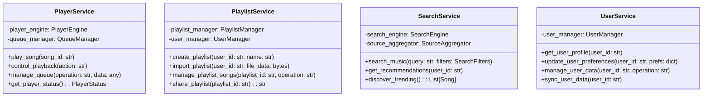

# BotPlayer 插件架构设计文档

## 整体架构概览

BotPlayer 是一个完整的音乐播放器插件，采用分层模块化架构设计，支持多音源、用户存档、播放队列等完整功能。系统设计遵循高内聚、低耦合的原则，确保可扩展性和可维护性。

### 系统层次架构


## 核心模块设计

### 1. 播放器引擎 (PlayerEngine)

播放器引擎是系统的核心模块，负责音频播放控制和状态管理。


**核心功能**:
- 音频播放控制（播放、暂停、停止、跳过）
- 播放状态管理和监控
- 音量控制和音质选择
- 播放进度跟踪
- 错误处理和自动恢复

### 2. 播放队列管理器 (QueueManager)

管理播放队列，支持多种播放模式和队列操作。


**核心功能**:
- 队列增删改查操作
- 多种播放模式支持（顺序、随机、单曲循环、列表循环）
- 播放历史记录
- 智能下一首推荐
- 队列持久化存储

### 3. 音源聚合器 (SourceAggregator)

统一管理多个音源平台，提供统一的音乐搜索和获取接口。


**核心功能**:
- 多音源平台统一接口
- 音源优先级管理
- 自动音源切换和备用方案
- 音源可用性监控
- 智能匹配和结果合并

### 4. 歌单管理器 (PlaylistManager)

负责歌单的创建、编辑、导入导出和同步功能。


**核心功能**:
- 歌单CRUD操作
- 安全的 URL 歌单导入（JSON 格式，HTTPS 协议）
- 歌单分享和协作
- webDAV云端同步
- 歌单标签和分类管理

### 5. 用户存档管理器 (UserManager)

管理用户个人数据、偏好设置和播放历史。


**核心功能**:
- 用户档案管理
- 个人偏好设置
- 播放历史记录
- 收藏和喜欢管理
- 个性化推荐
- 数据备份和恢复

### 6. 搜索引擎 (SearchEngine)

提供智能音乐搜索和推荐功能。


**核心功能**:
- 跨平台智能搜索
- 搜索结果缓存和优化
- 个性化推荐算法
- 热门音乐发现
- 搜索历史和建议

## 数据模型设计

### 核心实体模型


### 配置数据结构

```yaml
# 系统配置结构
botplayer:
  music_sources:
    bilibili:
      enabled: true
      api_key: "bilibili_api_key"
      rate_limit: 100
      priority: 1
    netease:
      enabled: true
      api_endpoint: "netease_api_endpoint"
      rate_limit: 50
      priority: 2
  
  storage:
    type: "sqlite"  # sqlite, postgresql, mysql
    connection_string: "sqlite:///data/botplayer.db"
    
  cache:
    enabled: true
    type: "redis"  # redis, memory
    size_limit: "1GB"
    expire_time: 7200
    
  audio:
    default_quality: "high"
    supported_formats: ["mp3", "flac", "ogg", "m4a"]
    max_file_size: "100MB"
    
  webdav:
    enabled: true
    server_url: "https://webdav.example.com"
    username: "user"
    password: "pass"
    sync_interval: 3600
```

## 服务层架构

### 应用服务层



### 命令处理架构


## 异步处理架构

### 事件驱动模型


### 音频流处理


## 错误处理架构

### 异常处理层次


### 容错机制

- **音源切换**: 当主音源不可用时自动切换到备用音源
- **自动重试**: 网络错误时自动重试，采用指数退避策略
- **降级处理**: 在系统负载过高时提供降级服务
- **缓存回退**: 利用缓存数据提供离线播放能力

## 性能优化架构

### 缓存策略


### 并发控制

- **连接池管理**: HTTP客户端连接池优化
- **异步IO**: 使用asyncio实现高并发处理
- **队列限流**: 防止过多并发请求导致系统过载
- **资源监控**: 实时监控内存、网络、磁盘使用情况

## 扩展性架构

### 插件化设计


### API扩展能力

- **RESTful API**: 提供标准HTTP API接口
- **WebSocket API**: 实时状态推送和双向通信
- **Webhook**: 事件通知和第三方集成
- **SDK**: 提供多语言SDK支持

## 安全架构

### 数据安全


### 安全策略

- **数据加密**: 敏感数据使用AES加密存储
- **访问控制**: 基于角色的权限控制系统
- **API安全**: API密钥管理和速率限制
- **内容过滤**: 违规内容检测和过滤机制
- **审计日志**: 完整的操作审计和日志记录

这个架构设计确保了 BotPlayer 插件能够提供完整、可靠、可扩展的音乐播放器功能，同时保持良好的性能和用户体验。
