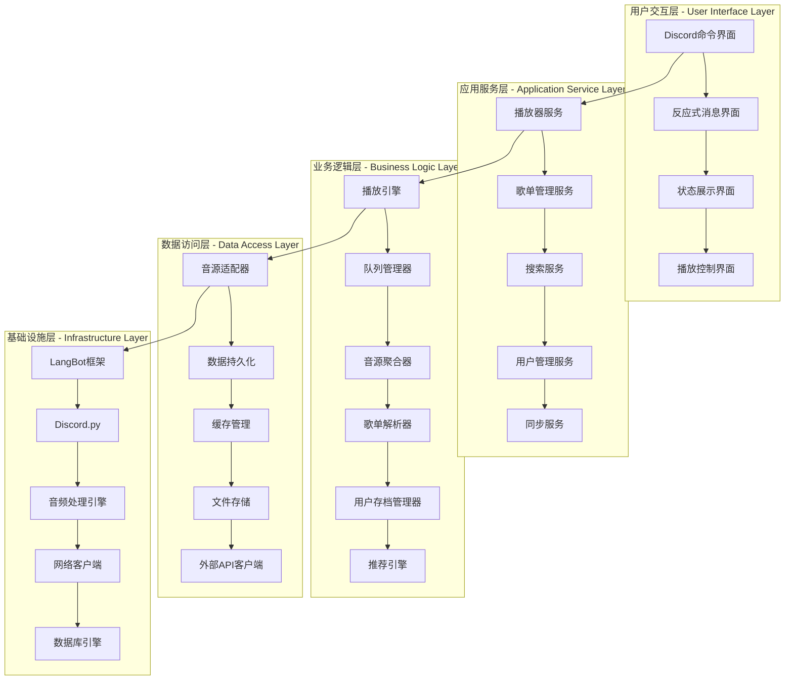
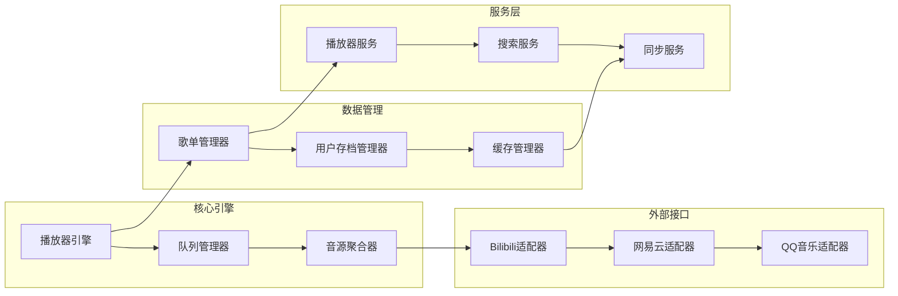
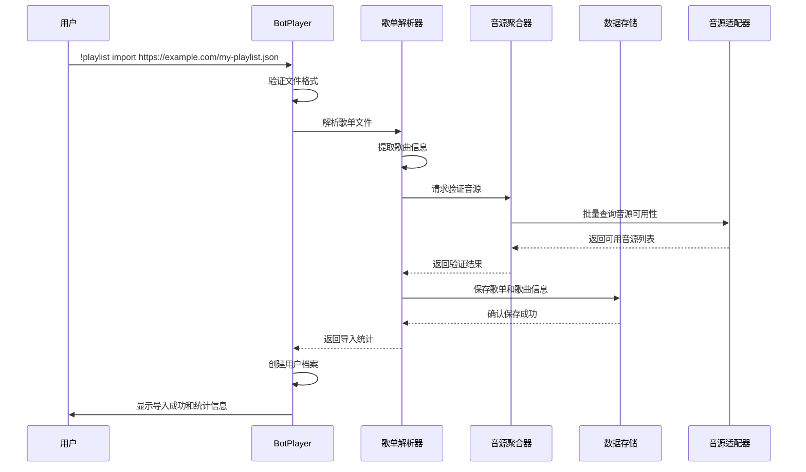
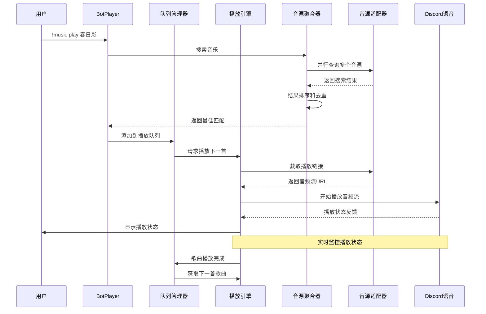
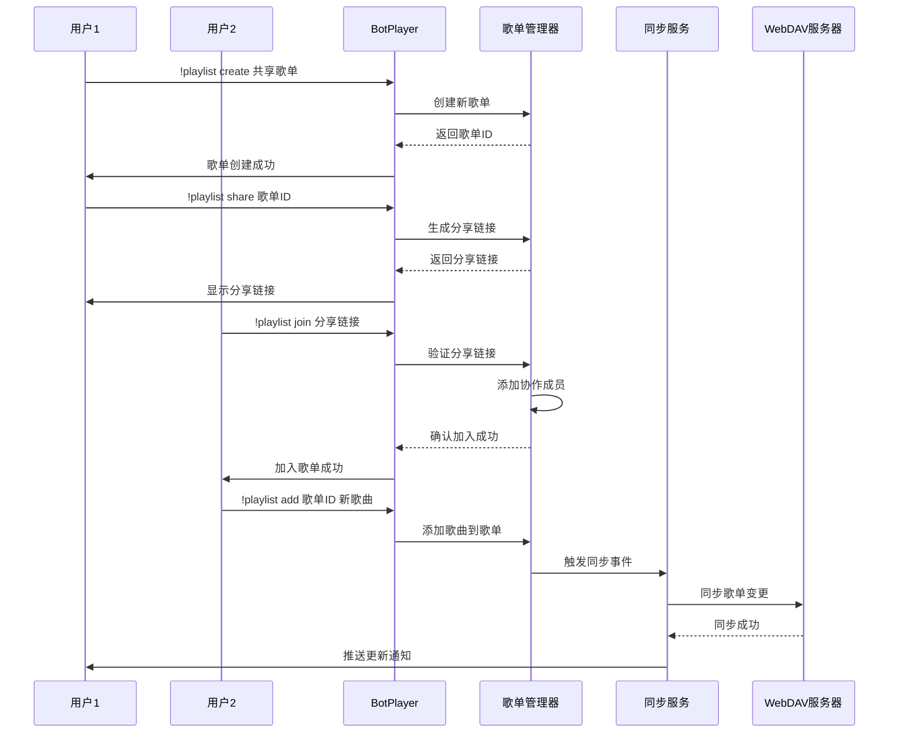
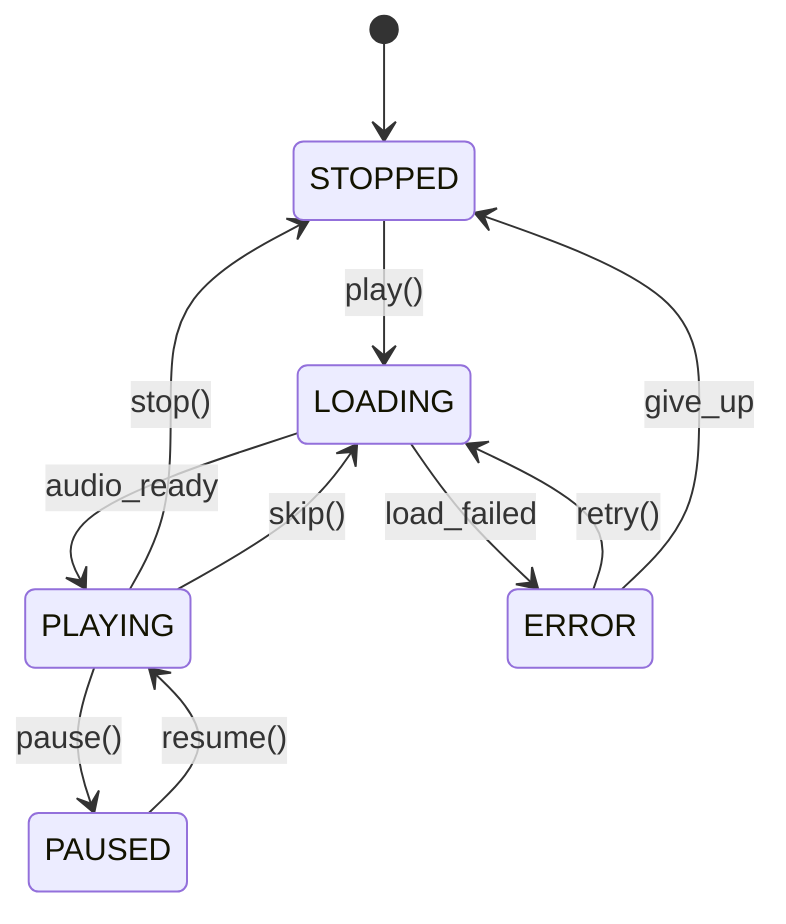

# BotPlayer 插件完整设计文档

## 概述

BotPlayer 是一个完整的音乐播放器插件，基于 LangBot 框架构建，旨在为 Discord 社区提供专业级的音乐播放体验。插件设计理念类似于 MusicFree，支持多音源整合、用户存档管理、歌单同步等完整功能。

## 项目愿景

### 核心目标
- **完整播放器体验**: 提供从音乐搜索到播放控制的完整音乐播放器功能
- **多音源整合**: 统一接入 bilibili、网易云音乐、QQ音乐等多个平台
- **用户中心设计**: 以用户个人音乐库和偏好为核心的产品设计
- **社区化特性**: 支持 Discord 社区内的音乐分享和协作

### 功能特色
- **歌单导入**: 支持 MusicFreeBackup.json 等多种格式的歌单导入
- **智能搜索**: 跨平台智能音乐搜索和匹配
- **播放模式**: 支持顺序、随机、循环等多种播放模式
- **用户存档**: 个人播放历史、收藏、偏好的持久化存储
- **实时同步**: 支持 webDAV 等云端同步方案

## 整体架构设计

### 系统分层架构



### 核心模块关系



## 核心业务流程设计

### 用户初次使用流程



### 音乐播放核心流程



### 歌单协作流程



## 详细模块设计

### 1. 播放器引擎 (PlayerEngine)

播放器引擎是系统的心脏，负责音频播放的核心控制逻辑。

#### 核心功能
- **播放控制**: play, pause, resume, stop, skip
- **音量管理**: volume control, fade in/out
- **状态监控**: playback status, progress tracking
- **音质管理**: quality selection, adaptive streaming
- **错误处理**: connection recovery, source switching

#### 关键特性
```python
class PlayerEngine:
    def __init__(self):
        self.current_song: Optional[Song] = None
        self.play_state: PlayState = PlayState.STOPPED
        self.volume: float = 0.8
        self.position: int = 0
        self.quality_preference: str = "high"
        
    async def play_song(self, song: Song, start_position: int = 0):
        """播放指定歌曲"""
        # 1. 获取最佳音源
        # 2. 创建音频流
        # 3. 开始播放
        # 4. 更新状态
        
    async def handle_playback_error(self, error: Exception):
        """处理播放错误"""
        # 1. 记录错误日志
        # 2. 尝试切换音源
        # 3. 通知用户
        # 4. 自动恢复播放
```

#### 状态管理


### 2. 音源聚合器 (SourceAggregator)

音源聚合器提供统一的音乐搜索和获取接口，隐藏各个音源平台的差异。

#### 设计理念
- **插件化架构**: 每个音源平台作为独立插件
- **智能匹配**: 基于相似度算法匹配最佳结果
- **降级策略**: 主音源不可用时自动切换备用音源
- **并行查询**: 同时查询多个音源提高响应速度

#### 核心算法
```python
class SourceAggregator:
    async def search_unified(self, query: str) -> List[Song]:
        """统一搜索接口"""
        # 1. 并行查询所有可用音源
        tasks = [source.search(query) for source in self.active_sources]
        results = await asyncio.gather(*tasks, return_exceptions=True)
        
        # 2. 结果合并和去重
        merged_results = self.merge_search_results(results)
        
        # 3. 智能排序
        ranked_results = self.rank_by_relevance(query, merged_results)
        
        return ranked_results
    
    def merge_search_results(self, results: List[List[Song]]) -> List[Song]:
        """智能合并搜索结果"""
        # 基于歌曲相似度合并重复结果
        # 保留多音源信息
        # 选择最佳音质版本
```

#### 音源优先级策略
```yaml
source_priority:
  bilibili:
    priority: 1
    quality_weight: 0.8
    availability_weight: 0.9
  netease:
    priority: 2
    quality_weight: 0.9
    availability_weight: 0.7
  qq_music:
    priority: 3
    quality_weight: 0.9
    availability_weight: 0.6
```

### 3. 歌单管理器 (PlaylistManager)

歌单管理器负责歌单的完整生命周期管理。

#### 核心功能
- **歌单解析**: 支持多种格式的歌单文件解析
- **歌单同步**: 云端同步和版本控制
- **协作管理**: 多用户歌单协作编辑
- **智能推荐**: 基于歌单内容的音乐推荐

#### MusicFree 格式解析器
```python
class MusicFreeParser:
    def parse_backup_file(self, file_content: bytes) -> List[Playlist]:
        """解析 MusicFree 备份文件"""
        data = json.loads(file_content.decode('utf-8'))
        playlists = []
        
        for sheet in data.get('musicSheets', []):
            playlist = Playlist(
                id=sheet['id'],
                name=sheet.get('title', sheet['id']),
                platform=sheet.get('platform', 'unknown')
            )
            
            for music_item in sheet.get('musicList', []):
                song = self.parse_music_item(music_item)
                playlist.songs.append(song)
            
            playlists.append(playlist)
        
        return playlists
    
    def parse_music_item(self, item: dict) -> Song:
        """解析单首歌曲信息"""
        return Song(
            id=item['id'],
            title=item['title'],
            artist=item['artist'],
            album=item.get('album', ''),
            duration=item.get('duration', 0),
            artwork_url=item.get('artwork', ''),
            platform=item['platform'],
            tags=item.get('tags', [])
        )
```

### 4. 用户存档管理器 (UserManager)

用户存档管理器维护用户的个人数据和偏好设置。

#### 数据结构设计
```python
@dataclass
class UserProfile:
    user_id: str
    display_name: str
    preferences: UserPreferences
    playlists: List[str]  # 拥有的歌单ID列表
    favorites: List[str]  # 收藏歌曲ID列表
    play_history: List[PlayRecord]
    created_at: datetime
    last_active: datetime
    
    # 统计信息
    total_play_time: int  # 总播放时长（秒）
    favorite_genres: List[str]  # 偏好音乐风格
    most_played_artists: List[str]  # 最常播放的艺术家
```

#### 个性化推荐算法
```python
class RecommendationEngine:
    def generate_recommendations(self, user: UserProfile) -> List[Song]:
        """生成个性化推荐"""
        # 1. 分析用户播放历史
        history_analysis = self.analyze_play_history(user.play_history)
        
        # 2. 提取音乐特征
        music_features = self.extract_music_features(history_analysis)
        
        # 3. 协同过滤推荐
        collaborative_songs = self.collaborative_filtering(user)
        
        # 4. 内容基础推荐
        content_based_songs = self.content_based_filtering(music_features)
        
        # 5. 混合推荐结果
        return self.merge_recommendations(collaborative_songs, content_based_songs)
```

### 5. 队列管理器 (QueueManager)

队列管理器实现智能播放队列功能。

#### 播放模式实现
```python
class QueueManager:
    def __init__(self):
        self.queue: List[Song] = []
        self.current_index: int = 0
        self.play_mode: PlayMode = PlayMode.SEQUENCE
        self.shuffle_order: List[int] = []
        self.history: List[Song] = []
    
    def get_next_song(self) -> Optional[Song]:
        """根据播放模式获取下一首歌曲"""
        if self.play_mode == PlayMode.SEQUENCE:
            return self._next_sequential()
        elif self.play_mode == PlayMode.SHUFFLE:
            return self._next_shuffle()
        elif self.play_mode == PlayMode.REPEAT_ONE:
            return self.current_song
        elif self.play_mode == PlayMode.REPEAT_ALL:
            return self._next_repeat_all()
    
    def add_intelligent_next(self, user_id: str) -> Song:
        """智能添加下一首歌曲"""
        # 基于用户历史和当前播放内容推荐
        recommendations = self.recommendation_engine.get_next_song_suggestions(
            current_song=self.current_song,
            user_id=user_id,
            context=self.get_queue_context()
        )
        
        if recommendations:
            self.queue.append(recommendations[0])
            return recommendations[0]
```

## 用户界面设计

### Discord 命令体系

#### 命令分组设计
```
🎵 播放控制命令组
├── !music play <搜索内容> - 搜索并播放音乐
├── !music pause - 暂停播放
├── !music resume - 恢复播放
├── !music stop - 停止播放
├── !music skip - 跳过当前歌曲
├── !music previous - 播放上一首
├── !music volume <0-100> - 调节音量
└── !music status - 查看播放状态

📝 歌单管理命令组
├── !playlist create <名称> - 创建新歌单
├── !playlist import <JSON_URL> - 通过 URL 导入歌单
├── !playlist list - 查看所有歌单
├── !playlist show <ID> - 显示歌单详情
├── !playlist play <ID> - 播放歌单
├── !playlist add <ID> <歌曲> - 添加歌曲
├── !playlist remove <ID> <索引> - 删除歌曲
└── !playlist share <ID> - 分享歌单

🔍 搜索发现命令组
├── !search <关键词> - 搜索音乐
├── !search artist <歌手> - 搜索歌手
├── !search album <专辑> - 搜索专辑
├── !discover trending - 热门音乐
├── !discover recommend - 个性化推荐
└── !discover similar - 相似音乐推荐

👤 用户管理命令组
├── !profile show - 查看个人资料
├── !profile history - 播放历史
├── !profile favorites - 收藏列表
├── !profile settings - 个人设置
└── !profile sync - 数据同步
```

#### 交互式界面设计

```python
class InteractivePlayerInterface:
    def create_player_embed(self, status: PlayerStatus) -> discord.Embed:
        """创建播放器状态嵌入消息"""
        embed = discord.Embed(
            title="🎵 正在播放",
            description=f"**{status.current_song.title}**\n👤 {status.current_song.artist}",
            color=0x1DB954  # Spotify 绿色
        )
        
        # 进度条
        progress_bar = self.create_progress_bar(status.position, status.duration)
        embed.add_field(name="⏱️ 播放进度", value=progress_bar, inline=False)
        
        # 播放模式和音量
        mode_text = self.get_play_mode_text(status.play_mode)
        embed.add_field(name="🔄 播放模式", value=mode_text, inline=True)
        embed.add_field(name="🔊 音量", value=f"{int(status.volume * 100)}%", inline=True)
        
        # 歌曲封面
        if status.current_song.artwork_url:
            embed.set_thumbnail(url=status.current_song.artwork_url)
        
        return embed
    
    def add_control_reactions(self, message: discord.Message):
        """添加播放控制反应按钮"""
        reactions = ["⏮️", "⏯️", "⏭️", "🔊", "🔀", "🔁", "❤️"]
        for reaction in reactions:
            await message.add_reaction(reaction)
```

### 状态显示设计

#### 播放状态卡片
```
🎵 正在播放
━━━━━━━━━━━━━━━━━━━━━━━
🎶 春日影 (MyGO!!!!! ver.)
👤 MyGO!!!!!
💿 专辑：春日影
⏱️ 02:35 / 04:20 ████████░░ 60%

🔄 播放模式：顺序播放
🔊 音量：80%
📱 音源：bilibili
⭐ 音质：高品质

📋 播放队列 (5首待播放)
1. 迷路日々 - MyGO!!!!!
2. 詩超絆 - MyGO!!!!!
3. 栞 - MyGO!!!!!
```

#### 歌单展示卡片
```
📝 歌单：我的收藏
👤 创建者：@用户名
📅 创建时间：2024-01-15
🎵 歌曲数量：138首
⏱️ 总时长：8小时42分钟

🏷️ 标签：#日系 #ACG #收藏

📊 统计信息：
• 最常播放：MyGO!!!!! (15首)
• 音源分布：bilibili (80%), 网易云 (20%)
• 平均音质：高品质

🔗 分享链接：https://bot.example.com/playlist/abc123
```

## 数据存储设计

### 数据库架构

#### 核心数据表设计
```sql
-- 歌曲信息表
CREATE TABLE songs (
    id VARCHAR(255) PRIMARY KEY,
    title VARCHAR(500) NOT NULL,
    artist VARCHAR(255) NOT NULL,
    album VARCHAR(255),
    duration INTEGER,
    artwork_url TEXT,
    lyrics TEXT,
    tags JSON,
    created_at TIMESTAMP DEFAULT CURRENT_TIMESTAMP,
    updated_at TIMESTAMP DEFAULT CURRENT_TIMESTAMP ON UPDATE CURRENT_TIMESTAMP,
    
    INDEX idx_title (title),
    INDEX idx_artist (artist),
    INDEX idx_album (album),
    FULLTEXT idx_search (title, artist, album)
);

-- 歌曲音源表
CREATE TABLE song_sources (
    song_id VARCHAR(255),
    platform VARCHAR(50),
    source_id VARCHAR(255),
    source_url TEXT,
    quality VARCHAR(20),
    bitrate INTEGER,
    format VARCHAR(10),
    available BOOLEAN DEFAULT TRUE,
    verified_at TIMESTAMP DEFAULT CURRENT_TIMESTAMP,
    
    PRIMARY KEY (song_id, platform),
    FOREIGN KEY (song_id) REFERENCES songs(id) ON DELETE CASCADE,
    INDEX idx_platform (platform),
    INDEX idx_available (available)
);

-- 歌单表
CREATE TABLE playlists (
    id VARCHAR(255) PRIMARY KEY,
    name VARCHAR(255) NOT NULL,
    owner_id VARCHAR(255) NOT NULL,
    description TEXT,
    is_public BOOLEAN DEFAULT FALSE,
    tags JSON,
    song_count INTEGER DEFAULT 0,
    total_duration INTEGER DEFAULT 0,
    created_at TIMESTAMP DEFAULT CURRENT_TIMESTAMP,
    updated_at TIMESTAMP DEFAULT CURRENT_TIMESTAMP ON UPDATE CURRENT_TIMESTAMP,
    
    INDEX idx_owner (owner_id),
    INDEX idx_public (is_public),
    INDEX idx_name (name)
);

-- 歌单歌曲关联表
CREATE TABLE playlist_songs (
    playlist_id VARCHAR(255),
    song_id VARCHAR(255),
    order_index INTEGER,
    added_at TIMESTAMP DEFAULT CURRENT_TIMESTAMP,
    added_by VARCHAR(255),
    
    PRIMARY KEY (playlist_id, song_id),
    FOREIGN KEY (playlist_id) REFERENCES playlists(id) ON DELETE CASCADE,
    FOREIGN KEY (song_id) REFERENCES songs(id) ON DELETE CASCADE,
    INDEX idx_order (playlist_id, order_index)
);

-- 用户档案表
CREATE TABLE user_profiles (
    user_id VARCHAR(255) PRIMARY KEY,
    display_name VARCHAR(255),
    preferences JSON,
    total_play_time INTEGER DEFAULT 0,
    favorite_genres JSON,
    created_at TIMESTAMP DEFAULT CURRENT_TIMESTAMP,
    last_active TIMESTAMP DEFAULT CURRENT_TIMESTAMP ON UPDATE CURRENT_TIMESTAMP,
    
    INDEX idx_last_active (last_active)
);

-- 播放历史表
CREATE TABLE play_history (
    id BIGINT AUTO_INCREMENT PRIMARY KEY,
    user_id VARCHAR(255),
    song_id VARCHAR(255),
    played_at TIMESTAMP DEFAULT CURRENT_TIMESTAMP,
    duration_played INTEGER,
    completed BOOLEAN DEFAULT FALSE,
    platform VARCHAR(50),
    
    FOREIGN KEY (user_id) REFERENCES user_profiles(user_id) ON DELETE CASCADE,
    FOREIGN KEY (song_id) REFERENCES songs(id) ON DELETE CASCADE,
    INDEX idx_user_time (user_id, played_at),
    INDEX idx_song (song_id)
);

-- 用户收藏表
CREATE TABLE user_favorites (
    user_id VARCHAR(255),
    song_id VARCHAR(255),
    added_at TIMESTAMP DEFAULT CURRENT_TIMESTAMP,
    
    PRIMARY KEY (user_id, song_id),
    FOREIGN KEY (user_id) REFERENCES user_profiles(user_id) ON DELETE CASCADE,
    FOREIGN KEY (song_id) REFERENCES songs(id) ON DELETE CASCADE
);
```

### 缓存策略设计

#### 多层缓存架构
```python
class CacheManager:
    def __init__(self):
        # L1: 内存缓存 - 热点数据
        self.memory_cache = TTLCache(maxsize=1000, ttl=300)
        
        # L2: Redis 缓存 - 会话数据
        self.redis_cache = redis.Redis(host='localhost', port=6379, db=0)
        
        # L3: 文件缓存 - 音频文件
        self.file_cache = FileCache(max_size="10GB", location="/tmp/botplayer_cache")
    
    async def get_song_metadata(self, song_id: str) -> Optional[Song]:
        """获取歌曲元数据，使用多层缓存"""
        # L1: 内存缓存
        if song_id in self.memory_cache:
            return self.memory_cache[song_id]
        
        # L2: Redis 缓存
        cached_data = await self.redis_cache.get(f"song:{song_id}")
        if cached_data:
            song = Song.from_json(cached_data)
            self.memory_cache[song_id] = song
            return song
        
        # L3: 数据库查询
        song = await self.database.get_song(song_id)
        if song:
            # 写入缓存
            await self.redis_cache.setex(
                f"song:{song_id}", 
                3600, 
                song.to_json()
            )
            self.memory_cache[song_id] = song
        
        return song
```

#### 缓存策略配置
```yaml
cache_policies:
  song_metadata:
    memory_ttl: 300      # 5分钟
    redis_ttl: 3600      # 1小时
    max_size: 1000       # 最大条目数
    
  search_results:
    memory_ttl: 180      # 3分钟
    redis_ttl: 1800      # 30分钟
    max_size: 500
    
  audio_files:
    file_ttl: 86400      # 24小时
    max_size: "10GB"     # 最大存储
    cleanup_threshold: 0.9  # 清理阈值
```

## 配置管理系统

### 配置文件结构
```yaml
# botplayer.yaml - 主配置文件
system:
  name: "BotPlayer"
  version: "1.0.0"
  debug: false
  max_concurrent_downloads: 5
  max_queue_size: 1000
  max_playlist_size: 5000

# 音源配置
sources:
  bilibili:
    enabled: true
    api_key: "${BILIBILI_API_KEY}"
    rate_limit: 100
    timeout: 30
    quality_preference: ["high", "medium", "low"]
    headers:
      User-Agent: "BotPlayer/1.0"
      Referer: "https://www.bilibili.com"
      
  netease:
    enabled: true
    api_endpoint: "https://music.163.com/api"
    rate_limit: 50
    timeout: 30
    encryption_key: "${NETEASE_ENCRYPTION_KEY}"
    
  qq_music:
    enabled: false
    api_key: "${QQ_MUSIC_API_KEY}"
    rate_limit: 30
    timeout: 30

# 数据库配置
database:
  type: "mysql"  # mysql, postgresql, sqlite
  host: "${DB_HOST:localhost}"
  port: "${DB_PORT:3306}"
  database: "${DB_NAME:botplayer}"
  username: "${DB_USER:root}"
  password: "${DB_PASS:password}"
  pool_size: 10
  max_overflow: 20
  
# 缓存配置
cache:
  redis:
    host: "${REDIS_HOST:localhost}"
    port: "${REDIS_PORT:6379}"
    database: 0
    password: "${REDIS_PASS:}"
    
  file_cache:
    location: "/data/cache"
    max_size: "10GB"
    cleanup_policy: "lru"
    
# WebDAV 同步配置（管理员配置）
user_sync:
  enabled: true
  webdav_configs:
    "user_id_1":
      server_url: "${WEBDAV_URL_USER1}"
      username: "${WEBDAV_USER1}"
      password: "${WEBDAV_PASS1}"
      sync_interval: 3600  # 1小时
      auto_backup: true
    "user_id_2":
      server_url: "${WEBDAV_URL_USER2}"
      username: "${WEBDAV_USER2}"
      password: "${WEBDAV_PASS2}"
      sync_interval: 7200  # 2小时
      auto_backup: true

# URL 导入安全配置
playlist_import:
  allowed_domains:
    - "*.github.com"
    - "*.githubusercontent.com"
    - "gist.github.com"
    - "pastebin.com"
  max_file_size: "10MB"
  timeout: 30
  allowed_extensions: [".json"]
  https_only: true
  
# 音频处理配置
audio:
  ffmpeg_path: "/usr/bin/ffmpeg"
  output_format: "opus"
  bitrate: "128k"
  sample_rate: 48000
  channels: 2
  
# 推荐系统配置
recommendation:
  enabled: true
  algorithm: "hybrid"  # collaborative, content_based, hybrid
  min_history_count: 10
  similarity_threshold: 0.7
  cache_duration: 1800
```

### 动态配置热更新
```python
class ConfigManager:
    def __init__(self, config_path: str):
        self.config_path = config_path
        self.config = {}
        self.watchers = []
        self.reload_callbacks = []
        
    async def watch_config_changes(self):
        """监控配置文件变化"""
        async for changes in aionotify.Watcher(self.config_path):
            if changes.flags & aionotify.Flags.MODIFY:
                await self.reload_config()
    
    async def reload_config(self):
        """重新加载配置"""
        try:
            new_config = self.load_config_file(self.config_path)
            old_config = self.config.copy()
            self.config = new_config
            
            # 通知所有监听者
            for callback in self.reload_callbacks:
                await callback(old_config, new_config)
                
        except Exception as e:
            logger.error(f"Failed to reload config: {e}")
    
    def register_reload_callback(self, callback):
        """注册配置重载回调"""
        self.reload_callbacks.append(callback)
```

## 错误处理和监控

### 异常处理体系

#### 异常类型定义
```python
class BotPlayerException(Exception):
    """BotPlayer 基础异常类"""
    def __init__(self, message: str, error_code: str, details: dict = None):
        super().__init__(message)
        self.error_code = error_code
        self.details = details or {}
        self.timestamp = datetime.utcnow()

class AudioPlaybackException(BotPlayerException):
    """音频播放异常"""
    pass

class SourceUnavailableException(BotPlayerException):
    """音源不可用异常"""
    pass

class PlaylistParseException(BotPlayerException):
    """歌单解析异常"""
    pass

class UserNotFoundException(BotPlayerException):
    """用户未找到异常"""
    pass
```

#### 全局异常处理器
```python
class ExceptionHandler:
    def __init__(self):
        self.error_strategies = {
            AudioPlaybackException: self.handle_playback_error,
            SourceUnavailableException: self.handle_source_error,
            PlaylistParseException: self.handle_playlist_error,
            UserNotFoundException: self.handle_user_error
        }
    
    async def handle_exception(self, exception: Exception, context: dict):
        """全局异常处理入口"""
        # 记录异常日志
        logger.error(f"Exception occurred: {exception}", exc_info=True)
        
        # 根据异常类型选择处理策略
        handler = self.error_strategies.get(type(exception), self.handle_generic_error)
        
        try:
            await handler(exception, context)
        except Exception as e:
            logger.critical(f"Exception handler failed: {e}")
            await self.handle_critical_error(e, context)
    
    async def handle_playback_error(self, exception: AudioPlaybackException, context: dict):
        """处理播放异常"""
        # 1. 尝试切换音源
        if context.get('retry_count', 0) < 3:
            await self.try_alternative_source(context)
        
        # 2. 通知用户
        await self.notify_user_error(context['user_id'], 
                                    "播放出现问题，正在尝试切换音源...")
        
        # 3. 记录错误统计
        self.metrics.increment('playback_errors')
```

### 监控和指标

#### 关键指标定义
```python
class MetricsCollector:
    def __init__(self):
        # 业务指标
        self.playback_success_rate = Counter('playback_success_total')
        self.playback_failure_rate = Counter('playback_failure_total')
        self.search_requests = Counter('search_requests_total')
        self.playlist_imports = Counter('playlist_imports_total')
        
        # 性能指标
        self.response_time = Histogram('response_time_seconds')
        self.audio_load_time = Histogram('audio_load_time_seconds')
        self.search_time = Histogram('search_time_seconds')
        
        # 系统指标
        self.active_users = Gauge('active_users_count')
        self.concurrent_players = Gauge('concurrent_players_count')
        self.cache_hit_rate = Gauge('cache_hit_rate')
        self.queue_size = Gauge('average_queue_size')
        
    async def record_playback_attempt(self, success: bool, duration: float):
        """记录播放尝试"""
        if success:
            self.playback_success_rate.inc()
        else:
            self.playback_failure_rate.inc()
        
        self.response_time.observe(duration)
```

#### 健康检查系统
```python
class HealthChecker:
    def __init__(self):
        self.checks = {
            'database': self.check_database,
            'redis': self.check_redis,
            'sources': self.check_music_sources,
            'audio_processing': self.check_audio_processing
        }
    
    async def get_health_status(self) -> dict:
        """获取系统健康状态"""
        results = {}
        overall_healthy = True
        
        for check_name, check_func in self.checks.items():
            try:
                result = await check_func()
                results[check_name] = result
                if not result['healthy']:
                    overall_healthy = False
            except Exception as e:
                results[check_name] = {
                    'healthy': False,
                    'error': str(e)
                }
                overall_healthy = False
        
        return {
            'healthy': overall_healthy,
            'checks': results,
            'timestamp': datetime.utcnow().isoformat()
        }
    
    async def check_music_sources(self) -> dict:
        """检查音源可用性"""
        source_status = {}
        healthy_sources = 0
        
        for source_name, source in self.source_manager.sources.items():
            try:
                # 执行简单的搜索测试
                results = await source.search("test", limit=1)
                source_status[source_name] = {
                    'healthy': True,
                    'response_time': results.get('response_time', 0)
                }
                healthy_sources += 1
            except Exception as e:
                source_status[source_name] = {
                    'healthy': False,
                    'error': str(e)
                }
        
        return {
            'healthy': healthy_sources > 0,
            'sources': source_status,
            'healthy_count': healthy_sources,
            'total_count': len(self.source_manager.sources)
        }
```

## 部署和运维

### 容器化部署

#### Dockerfile
```dockerfile
FROM python:3.11-slim

# 安装系统依赖
RUN apt-get update && apt-get install -y \
    ffmpeg \
    git \
    curl \
    && rm -rf /var/lib/apt/lists/*

# 设置工作目录
WORKDIR /app

# 复制依赖文件
COPY requirements.txt .
RUN pip install --no-cache-dir -r requirements.txt

# 复制应用代码
COPY . .

# 创建数据目录
RUN mkdir -p /data/cache /data/logs

# 设置环境变量
ENV PYTHONPATH=/app
ENV BOTPLAYER_CONFIG=/app/config/botplayer.yaml

# 健康检查
HEALTHCHECK --interval=30s --timeout=10s --start-period=30s --retries=3 \
    CMD curl -f http://localhost:8080/health || exit 1

# 暴露端口
EXPOSE 8080

# 启动命令
CMD ["python", "-m", "botplayer.main"]
```

#### Docker Compose 配置
```yaml
version: '3.8'

services:
  botplayer:
    build: .
    ports:
      - "8080:8080"
    environment:
      - DB_HOST=mysql
      - REDIS_HOST=redis
      - WEBDAV_URL=${WEBDAV_URL}
    volumes:
      - ./data:/data
      - ./config:/app/config
    depends_on:
      - mysql
      - redis
    restart: unless-stopped
    
  mysql:
    image: mysql:8.0
    environment:
      MYSQL_ROOT_PASSWORD: ${MYSQL_ROOT_PASSWORD}
      MYSQL_DATABASE: botplayer
    volumes:
      - mysql_data:/var/lib/mysql
      - ./sql/init.sql:/docker-entrypoint-initdb.d/init.sql
    restart: unless-stopped
    
  redis:
    image: redis:7-alpine
    volumes:
      - redis_data:/data
    restart: unless-stopped
    
  prometheus:
    image: prom/prometheus
    ports:
      - "9090:9090"
    volumes:
      - ./monitoring/prometheus.yml:/etc/prometheus/prometheus.yml
      - prometheus_data:/prometheus
    restart: unless-stopped
    
  grafana:
    image: grafana/grafana
    ports:
      - "3000:3000"
    environment:
      - GF_SECURITY_ADMIN_PASSWORD=${GRAFANA_PASSWORD}
    volumes:
      - grafana_data:/var/lib/grafana
      - ./monitoring/grafana:/etc/grafana/provisioning
    restart: unless-stopped

volumes:
  mysql_data:
  redis_data:
  prometheus_data:
  grafana_data:
```

### 运维脚本

#### 自动部署脚本
```bash
#!/bin/bash
# deploy.sh - 自动部署脚本

set -e

# 配置变量
IMAGE_NAME="botplayer"
VERSION="${1:-latest}"
BACKUP_DIR="/backup/botplayer"

echo "开始部署 BotPlayer v${VERSION}..."

# 1. 备份当前数据
echo "备份数据库..."
docker-compose exec mysql mysqldump -u root -p${MYSQL_ROOT_PASSWORD} botplayer > "${BACKUP_DIR}/db_$(date +%Y%m%d_%H%M%S).sql"

# 2. 拉取新版本
echo "构建新版本镜像..."
docker build -t ${IMAGE_NAME}:${VERSION} .

# 3. 停止旧版本
echo "停止旧版本服务..."
docker-compose stop botplayer

# 4. 数据库迁移
echo "执行数据库迁移..."
docker run --rm --network botplayer_default \
    -v $(pwd)/migrations:/migrations \
    ${IMAGE_NAME}:${VERSION} \
    python -m botplayer.migrate

# 5. 启动新版本
echo "启动新版本服务..."
docker-compose up -d botplayer

# 6. 健康检查
echo "等待服务启动..."
sleep 30

for i in {1..10}; do
    if curl -f http://localhost:8080/health; then
        echo "✅ 服务启动成功！"
        exit 0
    fi
    echo "等待服务启动... ($i/10)"
    sleep 10
done

echo "❌ 服务启动失败，开始回滚..."
docker-compose stop botplayer
docker-compose up -d botplayer
exit 1
```

#### 监控告警配置
```yaml
# monitoring/prometheus.yml
global:
  scrape_interval: 15s

scrape_configs:
  - job_name: 'botplayer'
    static_configs:
      - targets: ['botplayer:8080']

rule_files:
  - "alert_rules.yml"

alerting:
  alertmanagers:
    - static_configs:
        - targets:
          - alertmanager:9093

# monitoring/alert_rules.yml
groups:
  - name: botplayer
    rules:
      - alert: BotPlayerDown
        expr: up{job="botplayer"} == 0
        for: 1m
        labels:
          severity: critical
        annotations:
          summary: "BotPlayer 服务不可用"
          
      - alert: HighPlaybackFailureRate
        expr: rate(playback_failure_total[5m]) > 0.1
        for: 2m
        labels:
          severity: warning
        annotations:
          summary: "播放失败率过高"
          
      - alert: DatabaseConnectionFailure
        expr: mysql_up{job="mysql"} == 0
        for: 30s
        labels:
          severity: critical
        annotations:
          summary: "数据库连接失败"
```

## 测试策略

### 测试金字塔

```
    /\
   /  \     E2E Tests (端到端测试)
  /____\    Integration Tests (集成测试)
 /______\   Unit Tests (单元测试)
```

#### 单元测试示例
```python
import pytest
from unittest.mock import Mock, patch
from botplayer.core.player_engine import PlayerEngine
from botplayer.models.song import Song

class TestPlayerEngine:
    @pytest.fixture
    def player_engine(self):
        return PlayerEngine()
    
    @pytest.fixture
    def sample_song(self):
        return Song(
            id="test_song_1",
            title="测试歌曲",
            artist="测试歌手",
            duration=240
        )
    
    async def test_play_song_success(self, player_engine, sample_song):
        """测试播放歌曲成功场景"""
        with patch.object(player_engine, '_create_audio_source') as mock_source:
            mock_source.return_value = Mock()
            
            result = await player_engine.play_song(sample_song)
            
            assert result.success is True
            assert player_engine.current_song == sample_song
            assert player_engine.play_state == PlayState.PLAYING
    
    async def test_play_song_failure_with_retry(self, player_engine, sample_song):
        """测试播放失败时的重试机制"""
        with patch.object(player_engine, '_create_audio_source') as mock_source:
            # 第一次失败，第二次成功
            mock_source.side_effect = [Exception("Network error"), Mock()]
            
            result = await player_engine.play_song(sample_song)
            
            assert result.success is True
            assert mock_source.call_count == 2
```

#### 集成测试示例
```python
class TestPlaylistIntegration:
    @pytest.fixture
    async def app(self):
        """创建测试应用实例"""
        app = create_test_app()
        await app.initialize()
        yield app
        await app.cleanup()
    
    async def test_import_musicfree_playlist(self, app):
        """测试导入 MusicFree 歌单的完整流程"""
        # 准备测试数据
        musicfree_data = {
            "musicSheets": [{
                "id": "test_playlist",
                "musicList": [{
                    "id": "BV1234567890",
                    "title": "测试歌曲",
                    "artist": "测试歌手",
                    "platform": "bilibili"
                }]
            }]
        }
        
        # 模拟文件上传
        file_content = json.dumps(musicfree_data).encode()
        
        # 执行导入
        result = await app.playlist_service.import_playlist(
            file_content, 
            format="musicfree_backup", 
            user_id="test_user"
        )
        
        # 验证结果
        assert result.success is True
        assert len(result.playlists) == 1
        assert result.playlists[0].name == "test_playlist"
        assert len(result.playlists[0].songs) == 1
        
        # 验证数据库中的数据
        stored_playlist = await app.database.get_playlist(result.playlists[0].id)
        assert stored_playlist is not None
        assert stored_playlist.owner_id == "test_user"
```

#### 端到端测试示例
```python
class TestDiscordBotE2E:
    @pytest.fixture
    async def bot_client(self):
        """创建测试用的Discord机器人客户端"""
        client = TestDiscordClient()
        await client.login()
        yield client
        await client.logout()
    
    async def test_full_music_playback_workflow(self, bot_client):
        """测试完整的音乐播放工作流"""
        # 1. 用户发送播放命令
        message = await bot_client.send_message("!music play 春日影")
        
        # 2. 验证搜索响应
        response = await bot_client.wait_for_response(timeout=5)
        assert "搜索到" in response.content
        assert "春日影" in response.content
        
        # 3. 验证播放状态
        await asyncio.sleep(2)  # 等待播放开始
        status_message = await bot_client.send_message("!music status")
        status_response = await bot_client.wait_for_response(timeout=3)
        
        assert "正在播放" in status_response.content
        assert "春日影" in status_response.content
        
        # 4. 测试播放控制
        await bot_client.send_message("!music pause")
        pause_response = await bot_client.wait_for_response(timeout=3)
        assert "已暂停" in pause_response.content
```

### 性能测试

#### 负载测试脚本
```python
import asyncio
import aiohttp
from locust import HttpUser, task, between

class BotPlayerUser(HttpUser):
    wait_time = between(1, 3)
    
    def on_start(self):
        """测试开始时的初始化"""
        self.user_id = f"test_user_{self.environment.runner.user_count}"
        
    @task(3)
    def search_music(self):
        """音乐搜索测试"""
        self.client.get(f"/api/v1/search/songs?q=春日影&limit=10")
    
    @task(2)
    def get_playlist(self):
        """获取歌单测试"""
        self.client.get(f"/api/v1/users/{self.user_id}/playlists")
    
    @task(1)
    def play_music(self):
        """播放音乐测试"""
        self.client.post(f"/api/v1/player/test_guild/play", json={
            "song_id": "test_song_123"
        })
```

## 总结

BotPlayer 插件的完整设计涵盖了从用户需求分析到技术实现的各个方面。通过模块化的架构设计、完善的数据模型、智能的音源管理和用户友好的交互界面，BotPlayer 将为 Discord 社区提供专业级的音乐播放体验。

### 核心亮点
1. **完整播放器功能**: 类似 MusicFree 的丰富功能体验
2. **多音源整合**: 智能的跨平台音源聚合和切换
3. **用户存档系统**: 完善的个人数据管理和同步
4. **可扩展架构**: 插件化设计支持功能扩展
5. **智能推荐**: 基于用户行为的个性化推荐

### 技术优势
1. **高性能**: 异步架构和多层缓存确保快速响应
2. **高可用**: 完善的错误处理和自动恢复机制
3. **可运维**: 容器化部署和完整的监控体系
4. **可测试**: 全面的测试策略确保代码质量

这个设计文档为 BotPlayer 插件的开发提供了详细的技术规范和实现指南，确保项目能够按照既定目标顺利实施并交付高质量的产品。
