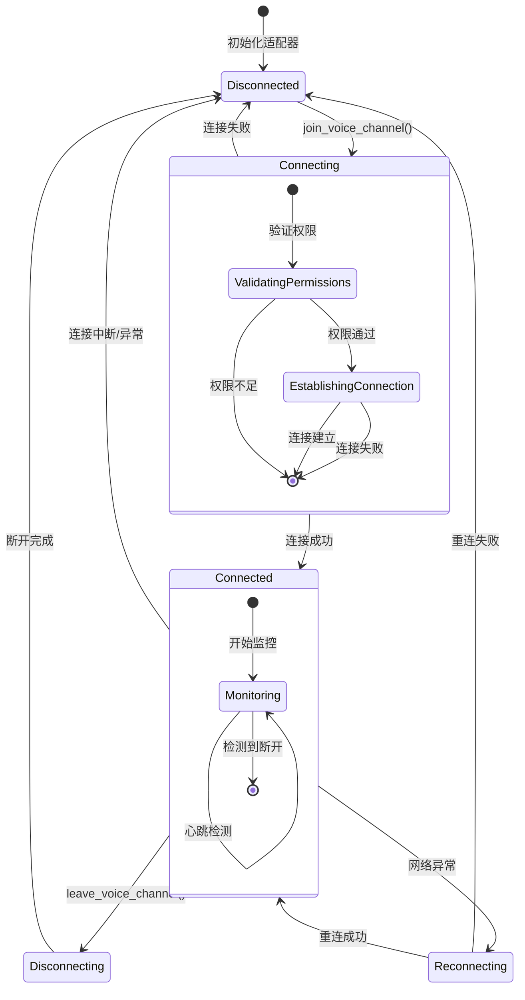
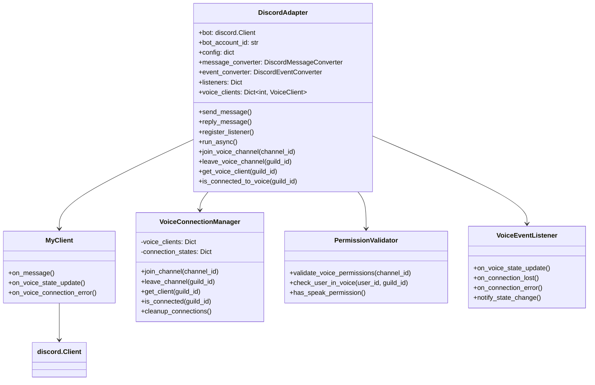

# Discord 适配器语音扩展架构设计

## 系统架构图

基于现有的 `pkg/platform/sources/discord.py` 中的 `DiscordAdapter` 类，语音扩展将作为适配器的增强模块，为其添加基础语音连接功能。

### Discord 适配器语音扩展状态机



### DiscordAdapter 类扩展架构



## 组件设计

### 1. DiscordAdapter 语音扩展

基于现有的 `DiscordAdapter` 类添加语音功能，保持与现有消息处理逻辑的兼容性。

**新增属性**:
```python
# 在现有 DiscordAdapter 类中添加
voice_clients: typing.Dict[int, discord.VoiceClient] = {}
```

**扩展方法**:
- `join_voice_channel(channel_id: int)`: 加入语音频道
- `leave_voice_channel(guild_id: int)`: 离开语音频道
- `get_voice_client(guild_id: int)`: 获取语音客户端
- `is_connected_to_voice(guild_id: int)`: 检查连接状态

### 2. MyClient 语音事件扩展

在现有的 `MyClient` 内部类中添加语音事件处理：

```python
class MyClient(discord.Client):
    # ...现有的 on_message 方法...
    
    async def on_voice_state_update(self, member, before, after):
        """语音状态更新事件处理"""
        await adapter_self._handle_voice_state_update(member, before, after)
    
    async def on_voice_connection_error(self, error):
        """语音连接错误事件处理"""
        await adapter_self._handle_voice_error(error)
```

### 3. 语音连接管理器 (VoiceConnectionManager)

**职责**:
- 管理多个服务器的语音连接
- 处理连接生命周期
- 维护连接状态

**核心功能**:
- 连接创建与销毁
- 状态监控与恢复
- 资源清理

### 4. 权限验证器 (PermissionValidator)

**职责**:
- 验证机器人语音权限
- 检查用户状态
- 提供权限错误信息

**验证项目**:
- 连接语音频道权限 (Connect)
- 发言权限 (Speak)
- 语音活动权限 (Use Voice Activity)

### 5. 语音事件监听器 (VoiceEventListener)

**职责**:
- 监听语音相关事件
- 处理连接状态变化
- 提供状态变化通知

**监听事件**:
- 语音状态更新 (voice_state_update)
- 连接断开事件
- 连接错误事件

## 接口设计

### DiscordAdapter 语音扩展接口

基于现有的 `DiscordAdapter` 类，添加以下语音功能方法：

```python
class DiscordAdapter(adapter.MessagePlatformAdapter):
    # ...现有属性和方法...
    
    # 新增语音功能属性
    voice_clients: typing.Dict[int, discord.VoiceClient] = {}
    
    async def join_voice_channel(self, channel_id: int, user_id: int) -> typing.Optional[discord.VoiceClient]:
        """
        加入语音频道
        
        Args:
            channel_id: Discord 语音频道ID
            user_id: 请求用户ID（用于验证用户是否在语音频道中）
            
        Returns:
            VoiceClient 实例或 None (失败时)
            
        Raises:
            VoiceConnectionError: 连接失败时抛出
            UserNotInVoiceError: 用户不在语音频道时抛出
            PermissionDeniedError: 权限不足时抛出
        """
        pass
        
    async def leave_voice_channel(self, guild_id: int) -> bool:
        """
        离开指定服务器的语音频道
        
        Args:
            guild_id: Discord 服务器ID
            
        Returns:
            bool: 是否成功断开连接
        """
        pass
        
    def get_voice_client(self, guild_id: int) -> typing.Optional[discord.VoiceClient]:
        """
        获取指定服务器的语音客户端
        
        Args:
            guild_id: Discord 服务器ID
            
        Returns:
            VoiceClient 实例或 None
        """
        pass
        
    def is_connected_to_voice(self, guild_id: int) -> bool:
        """
        检查是否连接到指定服务器的语音频道
        
        Args:
            guild_id: Discord 服务器ID
            
        Returns:
            bool: 是否已连接
        """
        pass
```

### 内部事件处理方法

```python
# 在 DiscordAdapter 类中添加的内部方法
async def _handle_voice_state_update(self, member, before, after):
    """处理语音状态更新事件"""
    pass

async def _handle_voice_error(self, error):
    """处理语音连接错误"""
    pass

async def _validate_voice_permissions(self, channel_id: int) -> bool:
    """验证语音频道权限"""
    channel = self.bot.get_channel(channel_id)
    if not channel:
        return False
    
    permissions = channel.permissions_for(channel.guild.me)
    
    required_permissions = [
        permissions.view_channel,
        permissions.connect,
        permissions.speak,
        permissions.use_voice_activation
    ]
    
    return all(required_permissions)

async def _cleanup_voice_connections(self):
    """清理无效的语音连接"""
    pass

async def _validate_user_in_voice(self, user_id: int, channel_id: int) -> bool:
    """验证用户是否在指定语音频道中"""
    channel = self.bot.get_channel(channel_id)
    if not channel:
        return False
    
    # 检查用户是否在该语音频道中
    for member in channel.members:
        if member.id == user_id:
            return True
    return False

async def _handle_voice_client_disconnect(self, guild_id: int):
    """处理语音客户端断开事件"""
    if guild_id in self.voice_clients:
        del self.voice_clients[guild_id]
    if guild_id in self.voice_connection_states:
        self.voice_connection_states[guild_id] = VoiceConnectionState.DISCONNECTED

async def _handle_voice_client_connect(self, guild_id: int, channel_id: int):
    """处理语音客户端连接事件"""
    if guild_id in self.voice_connection_states:
        self.voice_connection_states[guild_id] = VoiceConnectionState.CONNECTED
```

## 实现细节

### 语音连接状态管理

使用状态机模式管理每个服务器的语音连接状态：

```python
from enum import Enum

class VoiceConnectionState(Enum):
    DISCONNECTED = "disconnected"
    CONNECTING = "connecting" 
    CONNECTED = "connected"
    DISCONNECTING = "disconnecting"
    RECONNECTING = "reconnecting"
    ERROR = "error"

# 在 DiscordAdapter 中添加状态跟踪
voice_connection_states: typing.Dict[int, VoiceConnectionState] = {}
```

### Discord Client 集成

扩展现有的 `MyClient` 类以支持语音事件：

```python
class MyClient(discord.Client):
    async def on_message(self: discord.Client, message: discord.Message):
        # ...现有消息处理逻辑保持不变...
        
    async def on_voice_state_update(self, member, before, after):
        """新增：语音状态更新处理"""
        if member.id == self.user.id:  # 只处理机器人自己的状态变化
            await adapter_self._handle_voice_state_update(member, before, after)
    
    async def on_voice_client_disconnect(self, guild_id):
        """语音客户端断开事件"""
        await adapter_self._handle_voice_client_disconnect(guild_id)

    async def on_voice_client_connect(self, guild_id, channel_id):
        """语音客户端连接事件"""
        await adapter_self._handle_voice_client_connect(guild_id, channel_id)
```

### 配置扩展

在现有配置结构中添加语音功能配置：

```yaml
discord:
  token: "your_bot_token"
  client_id: "your_client_id"
  
  # 新增语音配置段
  voice:
    enabled: true                    # 是否启用语音功能
    connection_timeout: 10           # 连接超时时间(秒)
    reconnect_attempts: 3            # 重连尝试次数
    auto_disconnect_timeout: 300     # 无用户时自动断开时间(秒)
    max_connections: 10              # 最大并发连接数
```

## 错误处理策略

### 连接错误处理

基于现有的错误处理模式，添加语音连接相关的异常处理：

```python
class VoiceConnectionError(Exception):
    """语音连接相关错误基类"""
    pass

class PermissionDeniedError(VoiceConnectionError):
    """权限不足错误"""
    pass

class ChannelNotFoundError(VoiceConnectionError):
    """频道不存在错误"""
    pass

class NetworkError(VoiceConnectionError):
    """网络连接错误"""
    pass

class UserNotInVoiceError(VoiceConnectionError):
    """用户不在语音频道错误"""
    pass

class AlreadyConnectedError(VoiceConnectionError):
    """已连接到语音频道错误"""
    pass
```

### 错误恢复机制

```python
async def join_voice_channel(self, channel_id: int, user_id: int) -> typing.Optional[discord.VoiceClient]:
    try:
        # 用户状态验证
        if not await self._validate_user_in_voice(user_id, channel_id):
            raise UserNotInVoiceError(f"User {user_id} is not in voice channel {channel_id}")
        
        # 权限验证
        if not await self._validate_voice_permissions(channel_id):
            raise PermissionDeniedError(f"No permission to join channel {channel_id}")
        
        # 检查是否已连接
        channel = self.bot.get_channel(channel_id)
        if not channel:
            channel = await self.bot.fetch_channel(channel_id)
        
        guild_id = channel.guild.id
        if guild_id in self.voice_clients and self.voice_clients[guild_id].is_connected():
            raise AlreadyConnectedError(f"Already connected to voice in guild {guild_id}")
        
        # 设置连接状态
        self.voice_connection_states[guild_id] = VoiceConnectionState.CONNECTING
        
        # 建立语音连接
        voice_client = await channel.connect()
        self.voice_clients[guild_id] = voice_client
        self.voice_connection_states[guild_id] = VoiceConnectionState.CONNECTED
        
        await self.logger.info(f"Successfully connected to voice channel {channel_id} in guild {guild_id}")
        return voice_client
        
    except discord.errors.ClientException as e:
        self.voice_connection_states[guild_id] = VoiceConnectionState.ERROR
        await self.logger.error(f"Discord voice connection failed: {e}")
        raise VoiceConnectionError(f"Failed to connect: {e}")
    except (UserNotInVoiceError, PermissionDeniedError, AlreadyConnectedError):
        self.voice_connection_states[guild_id] = VoiceConnectionState.DISCONNECTED
        raise
    except Exception as e:
        self.voice_connection_states[guild_id] = VoiceConnectionState.ERROR
        await self.logger.error(f"Unexpected voice connection error: {e}")
        raise VoiceConnectionError(f"Unexpected error: {e}")
```

## 性能考虑

### 资源管理

- **连接复用**: 每个服务器只维护一个语音连接
- **自动清理**: 定期清理无效或超时的连接
- **内存优化**: 及时释放断开连接的资源

### 并发控制

- **异步操作**: 所有语音操作使用异步模式，避免阻塞主线程
- **状态同步**: 使用锁机制保证状态变更的原子性
- **连接限制**: 限制同时处理的语音连接操作数量

### 监控指标

- **连接状态**: 实时跟踪每个服务器的连接状态
- **延迟监控**: 记录连接建立和断开的耗时
- **错误统计**: 统计各类错误的发生频率
